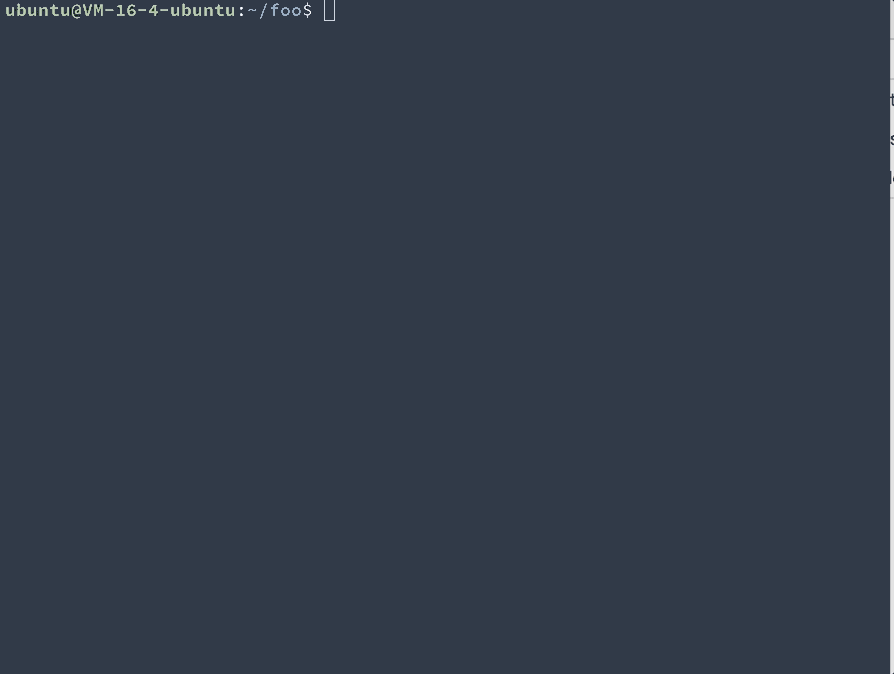

# NQM

When you want to install a specific package, but don't remember full name of it. Don't worry, `nqm` come to rescue.

nqm(nqm = npm + query) is a JavaScript package manager with query command.

nqm has an additional command `query`(alias is `q`) for searching packages. Other commands keep the same with npm, you can replace npm with nqm.

## Screenshot

## Installation
`npm i nqm -g`

## Usage
`nqm query react --save`
or 
`nqm q react --save `

